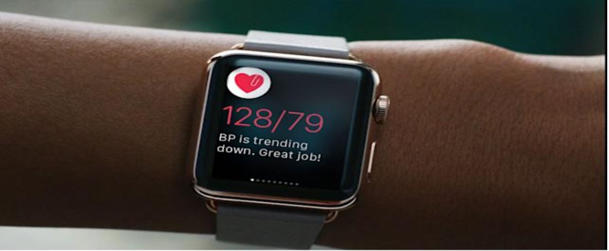
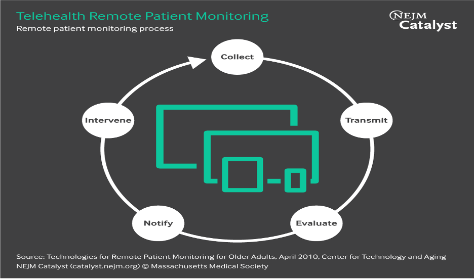

## Introduction
Hypertension is a silent killer, you probably won't first experience any symptoms. It develops into a chronic illness over time, eventually causing symptoms including headaches and chest pain.
Regularly checking your blood pressure can protect you from heart illnesses.
The biggest cause of death in the US is cardiovascular disease. The number of deaths from heart disease grew by 4.8% in 2020, which is the highest increase since 2012.
A recurring relationship between cardiac problems and potentially catastrophic results is hypertension. Risk factors might be either modifiable (heavy alcohol consumption and an unhealthy lifestyle) or immutable (family history of hypertension). But one thing is certain: hypertension is typically an illness that may be avoided.
In order to acquire patient health data without unduly taxing hospitals and emergency rooms, remote patient monitoring (RPM) was developed. Our chronic patients' quality of life has considerably improved because to remote monitoring. Remote patient monitoring has today's opened doors to more digital health treatments, collaborating with insurers and billing firms to deliver more convenience to patients, as it brought continuity of care among patients with COVID-19

## Telemedicine in the management of high blood pressure
Over the previous two decades, as antihypertensive medication treatment became more widely accessible, the control rate of hypertension significantly rose in many nations. For instance, the knowledge, treatment, and control rates of hypertension were 46.9%, 40.7%, and 15.3%, respectively, in China, according to the most current nationwide hypertension survey conducted between 2012 and 2015 among 451 755 individuals (18 years). Nevertheless, China's control rate for treated hypertension patients (37.6%) and general community awareness levels both remained low.
Emerging technologies, like telemedicine, could be useful in populous nations like China. The Chinese government offers affordable antihypertensive drugs and health insurance. 6 The challenge is to promptly and thoroughly identify patients with increased blood pressure and to treat those who have been identified with hypertension effectively and aggressively. Telemedicine may be crucial for both diagnosis and therapy. Telemedicine technology has advanced quickly over the past 20 years, starting with blood pressure monitoring and moving on to combined monitoring and interventions and, more recently, interactive platforms between doctors and patients  (Hypertens(Greenwich), 2021).

## Blood pressure telemonitoring 
A cutting-edge area of telemonitoring or telemedicine research is home blood pressure monitoring. Researchers have been looking into the potential impacts of telemonitoring on blood pressure control ever since automated electronic blood pressure monitors became available for blood pressure measurement at home. In comparison to the usual care control group, telemonitoring using an automated telephone transmission system increased treatment adherence and blood pressure control by 4.7/4.4 mmHg of better clinic systolic/diastolic blood pressure reductions (P .02). The cost and intensity of antihypertensive medication increased as a result of home blood pressure monitoring. There was no difference in the risk of unfavorable events. Despite its diversity, home blood pressure telemonitoring equipment has been shown to be effective in managing hypertension. Because many people have a tendency to think that their blood pressure is normal, home blood pressure monitoring can help but is insufficient to increase public awareness of hypertension. Today, hundreds of individuals utilize the system every day in a variety of public locations, including airports, retail centers, and office buildings. It is envisaged that the system will significantly enhance the detection and management of hypertension in China after a sufficient number of blood pressure monitors have been implemented during the coming few years (Hypertens(Greenwich), 2021).  

# Why telemedicine is important for high blood pressure? 
## Remote Patient Monitoring (RPM)
Through electronic equipment including wearables, mobile devices, smartphone apps, and internet-connected computers, patient health data are reported, collected, transmitted, and evaluated in remote patient monitoring. The use of RPM technologies prompts patients to weigh themselves and sends the results to their doctors. Blood pressure, heart data, oxygen saturation levels, and respiration rates are just a few of the vital sign measurements that are being collected and transmitted using wearables and other electronic monitoring devices. Additionally, devices are utilized to monitor blood glucose levels and alert patients and healthcare professionals when levels are high or low. Patients frequently wait several months before seeing a doctor. RPM can enable for earlier diagnosis of issues and identify people who need to seek medical assistance prior to in-person appointments. Additionally, chronic illnesses can be controlled more easily and effectively, leading to better care and results as well as lower costs (NEJM Catalyst, 2018).

## Remote patient monitoring (RPM) cycle in telehealth

## Benefits and Challenges
Despite the fact that telehealth is still in its infancy, it has the potential to be very beneficial in the management of a number of illnesses, including high blood pressure:
•	Regular at-home monitoring: A recent study revealed how easily study subjects accepted telehealth for blood pressure monitoring. 94% of the 432 participants invited to participate in a study on the efficacy of telehealth for blood pressure management completed the data collecting process, which comprised utilizing at-home blood pressure monitors and reporting readings to their telehealth providers.
Due to the fact that blood pressure can alter over time, telehealth makes it simple to routinely self-monitor and report any changes to a provider.

•	Avoiding "white coat hypertension": White coat hypertension is a condition that some people experience. This refers to those who experience worry, anxiety, or discomfort while in a medical setting and have blood pressure readings that are higher than usual. If you frequently experience white coat hypertension, taking readings at home and sending them to your doctor can help you receive the most accurate reading.

•	Doctors are easily accessible: One of the main advantages of telehealth services is that they easily connect consumers to a variety of providers and medical professionals who may be geographically out of reach. It provides an opportunity for people who don't have access to a car or live far from public transportation to receive specialist treatment at home. Those who are elderly and may find it difficult to travel to a doctor's office may favor telehealth appointments.

•	Cost-effectiveness: According to a recent 2020 study, telemedicine during the COVID-19 pandemic proved to be comparatively cost-effective, making medical care more accessible to a larger population.
But not all insurance companies pay for telemedicine visits. Access to technology can also be a significant obstacle for telehealth services. Telehealth may not be accessible to someone who lacks a dependable Internet connection, modern equipment, or health insurance (Mastroianni, 2021).

## conclusion
When evaluating your general health, especially if you have hypertension, it's crucial to keep track of your blood pressure. It can assist you and your healthcare professional in monitoring for serious illnesses including heart disease. The best way to do that is through telehealth.
Telehealth visits, however, might only be a small part of your overall treatment for high blood pressure. For in-person visits, you could still be required to attend to the doctor's office. Telehealth enhances your overall care by providing you with quick access to a variety of specialists and helping you manage your blood pressure and other health issues.

## sources
1. DrKumo. (2022, April 14). Digital healthcare Intervention: Using RPM to lower blood presure. Connected Health Technology. Retrieved December 15, 2022, from https://drkumo.com/ways-to-lower-blood-pressure/
2. Hypertens(Greenwich), J. C. (2021, January 23). Telemedicine in the management of hypertension. Clinical Hypertention. Retrieved December 15, 2022, from https://www.ncbi.nlm.nih.gov/pmc/articles/PMC8029526/
3. Mastroianni, B. (2021, July 06). Telehealth for blood pressure. Verywell Health. Retrieved December 20, 2022, from https://www.verywellhealth.com/telehealth-for-blood-pressure-5186141
4. NEJM Catalyst. (2018, February 1). What is Telehealth. Innovations in Care Delivery. Retrieved December 15, 2022, from https://catalyst.nejm.org/doi/full/10.1056/CAT.18.0268
5. wikipeadia.com
